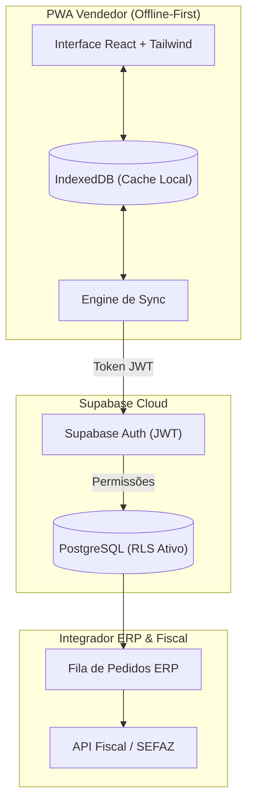

# Ampla Vendas Pro • ERP Força de Vendas v2.4

> **Progressive Web App (PWA) Offline-First** para automação de força de vendas em campo, com armazenamento local IndexedDB, captura de assinatura digital, consulta de catálogo e sincronização com backend Supabase / ERP.

[](https://amplainfo.axio.eng.br/)
[](https://amplainfo.axio.eng.br/)
[](docs/supabase_schema_rls.sql)
[](docs/adr/0001-evolucao-arquitetural-pwa-supabase.md)

---

## 🌐 Produção e Borda

A aplicação é implantada e servida na borda (Edge CDN) através de domínio customizado:

* **URL de Acesso:** [https://amplainfo.axio.eng.br/](https://amplainfo.axio.eng.br/)
* **CNAME:** [`amplainfo.axio.eng.br`](CNAME)
* **Tecnologia Frontend:** Single Page Application (React / PWA) minificada em bundle de alta performance.

---

## 📐 Visão Arquitetônica e Segurança

A arquitetura do projeto segue o modelo de transição de **MVP Demonstrativo para Produção Corporativa**, conforme formalizado no [ADR 0001](docs/adr/0001-evolucao-arquitetural-pwa-supabase.md):



### Principais Pilares da Arquitetura:
1. **Offline-First:** Leitura e gravação de pedidos em campo via `IndexedDB`, garantindo operação contínua mesmo sem sinal de celular.
2. **Segurança Multi-Tenant (RLS):** As tabelas do PostgreSQL no Supabase utilizam **Row Level Security (RLS)** para garantir que cada vendedor acesse apenas a sua própria carteira de clientes e pedidos.
3. **Fronteira Fiscal Desacoplada:** O PWA atua na pré-emissão e geração de espelhos de pedido. A transmissão de NF-e/NFC-e na SEFAZ com certificado A1/A3 é delegada à camada de backend/API fiscal.

---

## 📂 Estrutura do Repositório

```text
infointra/
├── assets/                  # Bundle JS/CSS minificado (Vite/React build)
├── docs/                    # Documentação técnica e de arquitetura
│   ├── adr/
│   │   └── 0001-evolucao-arquitetural-pwa-supabase.md  # Arquitetura & Decisões
│   └── supabase_schema_rls.sql  # Script DDL PostgreSQL com RLS para Supabase
├── 404.html                 # Roteamento de fallback para GitHub Pages SPA
├── CNAME                    # Configuração do domínio personalizado
├── index.html               # Entrypoint da aplicação PWA
└── README.md                # Documentação principal do projeto
```

---

## ⚡ Plano de Evolução de 7 Dias (Sprint de Alta Velocidade)

Em consonância com a avaliação técnica para a **Ampla Informática**:

- [x] **Dia 1:** Formalização Arquitetônica ([ADR 0001](docs/adr/0001-evolucao-arquitetural-pwa-supabase.md)) e Schema SQL PostgreSQL com RLS ([`supabase_schema_rls.sql`](docs/supabase_schema_rls.sql)).
- [ ] **Dia 2:** Integração do Supabase Auth no PWA e proteção de sessões de vendedores via JWT.
- [ ] **Dia 3:** Aprimoramento do motor de sincronização IndexedDB -> Supabase com controle de estados e *exponential backoff*.
- [ ] **Dia 4:** Rotulagem clara da interface ("Espelho do Pedido" vs "Emissão Fiscal ERP/SEFAZ") e suporte a lotes XML.
- [ ] **Dia 5:** Testes de integração offline-to-online e auditoria de resiliência.
- [ ] **Dia 6:** Documentação detalhada dos fluxos de dados e guias de manutenção.
- [ ] **Dia 7:** Apresentação funcional para a liderança técnica da Ampla Informática.

---

## 🚀 Como Executar Localmente

Como a distribuição atual consiste no build estático:

1. Clone o repositório:
   ```bash
   git clone https://github.com/bbanho/infointra.git
   cd infointra
   ```
2. Sirva o diretório local através de qualquer servidor HTTP estático (ex: Python, Live Server ou `npx serve`):
   ```bash
   npx serve .
   ```
3. Acesse `http://localhost:3000` no navegador.

---

## 🛠️ Tecnologias Utilizadas

* **Frontend:** React, HTML5 PWA (Service Workers, IndexedDB, Manifest), TailwindCSS, Lucide Icons.
* **Backend Target:** Supabase PostgreSQL, Supabase Auth, Row Level Security (RLS).
* **Hospedagem & CDN:** GitHub Pages com Custom Domain (`amplainfo.axio.eng.br`).

---
*Documentação mantida pela Engenharia de Software da Ampla Informática.*
