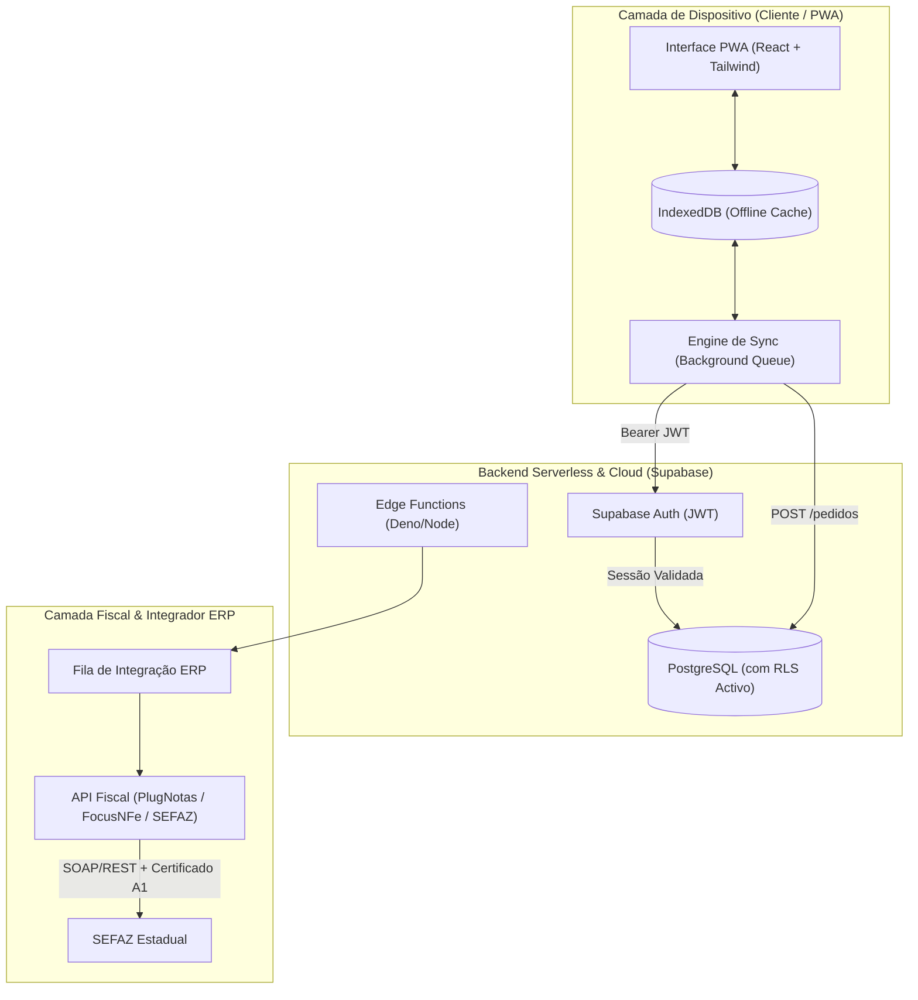

# ADR 0001: Evolução da Arquitetura do Ampla Vendas Pro (PWA Offline-First para Produção)

* **Status:** Aceito / Em Execução
* **Data:** 2026-08-05
* **Contexto do Projeto:** Candidatura e Avaliação de Engenharia (Ampla Informática)
* **Domínio de Produção:** `https://amplainfo.axio.eng.br/`
* **Repositório:** [infointra](https://github.com/bbanho/infointra)

---

## 1. Contexto e Problema

O **Ampla Vendas Pro** é uma solução Progressive Web App (PWA) Offline-First projetada para automação de força de vendas. Atualmente, o projeto encontra-se hospedado como uma Single Page Application (SPA) estática servida via Edge CDN (GitHub Pages), utilizando armazenamento local via `IndexedDB` e simulações client-side de emissão fiscal.

Em uma auditoria técnica de resiliência, escalabilidade e governança administrativa, foram identificados os seguintes gargalos estruturais para entrada em produção corporativa:

1. **Vulnerabilidade de Autenticação e Multi-Tenancy:** A seleção de vendedores e perfis ocorre exclusivamente no estado da interface gráfica (client-side), sem validação por token de autenticação (JWT) nem controle de permissão por linha (Row Level Security - RLS).
2. **Riscos de Integridade e Perda de Dados:** Os pedidos de vendas, cadastros de clientes e assinaturas digitais ficam retidos no banco local do navegador (`IndexedDB`) sem uma fila de sincronização em segundo plano resiliente contra limpeza de cache, perda de dispositivo ou falhas de rede.
3. **Ambiguidade na Camada Fiscal:** O aplicativo simula a transmissão de NF-e (Modelo 55) e NFC-e/SAT (Modelo 65) diretamente no navegador com chaves de acesso geradas aleatoriamente (`Math.random()`), criando o risco de confusão operacional entre "Espelho de Pedido" e "Emissão Fiscal Legítima na SEFAZ".
4. **Acoplamento de Responsabilidades:** O bundle JavaScript do frontend contém scripts DDL de banco de dados (`CREATE TABLE`), mapas relacionais e geradores de lotes XML, sobrecarregando a camada de apresentação.

---

## 2. Decisão Arquitetônica (Target Architecture)

Para elevar a maturidade do sistema ao padrão corporativo exigido pela **Ampla Informática**, decide-se adotar a seguinte arquitetura de referência:

### Componentes Principais:
* **Frontend (PWA):** Mantido como cliente leve, focado na experiência de vendas offline-first, captura de assinaturas digitais, navegação rápida em catálogo e geração de espelhos de pedido.
* **Segurança & Dados (Supabase PostgreSQL + RLS):** Centralização de autenticação via Supabase Auth e isolamento estrito de tenancy via Row Level Security (RLS) no PostgreSQL.
* **Fila de Sincronização Resiliente:** Motor de sincronização no cliente com controle rigoroso de ciclo de vida (`pendente_sync`, `enviando`, `sincronizado`, `falha`) e retentativas automáticas (*exponential backoff*).
* **Desacoplamento Fiscal:** A emissão fiscal é formalmente delegada para serviços de retaguarda (API Fiscal / ERP), mantendo o PWA focado na pré-emissão e consulta de status.

---

## 3. Plano de Ação em Sprint de 7 Dias (Alta Velocidade)

Em conformidade com a cadência acelerada da avaliação técnica na Ampla Informática:

| Dia | Foco Principal | Entregáveis Técnicos |
| :--- | :--- | :--- |
| **Dia 1** | **Arquitetura & Schema SQL** | Registro desta ADR (`docs/adr/0001-...`) e criação do script SQL profissional com RLS (`supabase_schema_rls.sql`). |
| **Dia 2** | **Autenticação & Isolamento** | Integração do Supabase Auth no PWA, substituição da troca livre de perfil por login seguro via JWT. |
| **Dia 3** | **Refatoração de Sync** | Aprimoramento da engine IndexedDB, tratamento de falhas de rede e indicadores visuais de conectividade. |
| **Dia 4** | **Fronteira Fiscal & UX** | Rotulagem clara da interface ("Espelho do Pedido" vs "Status Fiscal ERP/SEFAZ") e exportação estruturada de XML. |
| **Dia 5** | **Testes E2E & Qualidade** | Testes de integração (fluxo offline -> online) e auditoria de bundle size. |
| **Dia 6** | **Documentação & Handoff** | Atualização do `README.md` principal com instruções de deploy, configuração de ambiente e guias de contribuição. |
| **Dia 7** | **Apresentação Executiva** | Demonstração funcional do PWA fortalecido para a liderança da Ampla Informática. |

---

## 4. Objetivos Futuros e Visão de Longo Prazo (Roadmap)

Visando a expansão contínua do produto na **Ampla Informática**:

1. **Integrador ERP Bidirecional Automático:**
   * Implementação de Webhooks no Supabase conectando o PWA ao ERP principal da Ampla para atualização de estoque em tempo real e tabelas de preço dinâmicas.
2. **Impressão Térmica Direta (Bluetooth / ESC-POS):**
   * Suporte a impressão de comprovantes de vendas e cupons diretamente em impressoras portáteis via Web Bluetooth API.
3. **Telemetria e Observabilidade de PWA:**
   * Monitoramento de erros em tempo real (Sentry) e métricas de desempenho offline/online (Core Web Vitals em PWA).
4. **Suporte Multi-Empresa e Tabelas de Preço Regionais:**
   * Suporte a múltiplas filiais, depósitos e políticas comerciais avançadas (descontos por volume, margem mínima por vendedor).

---

## 5. Consequências e Impacto Esperado

* **Positivas:**
  * **Segurança Industrial:** Elimina o risco de vazamento de dados de clientes e pedidos entre vendedores.
  * **Confiabilidade:** Garante zero perda de vendas colhidas em campo, mesmo sem sinal de internet.
  * **Conformidade Jurídica/Fiscal:** Esclarece os limites da aplicação no navegador em relação às obrigações SEFAZ.
  * **Maturidade Técnica:** Demonstra alto padrão de engenharia de software na avaliação de contratação da Ampla Informática.

---
*Documento mantido sob controle de versão no repositório oficial.*
