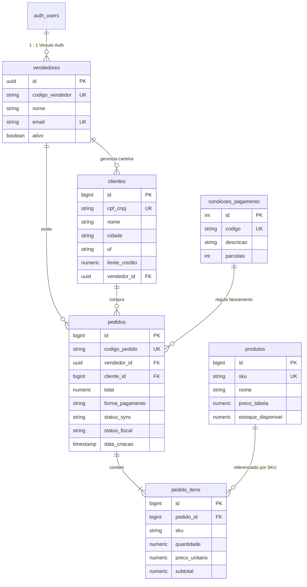

# 🗄️ Diagrama Entidade-Relacionamento (ER) do Supabase PostgreSQL

```mermaid
erDiagram
    auth_users ||--o{ vendedores : "1 : 1 Vinculo Auth"
    vendedores ||--o{ clientes : "gerencia carteira"
    vendedores ||--o{ pedidos : "emite"
    clientes ||--o{ pedidos : "compra"
    pedidos ||--|{ pedido_itens : "contem"
    produtos ||--o{ pedido_itens : "referenciado por SKU"
    condicoes_pagamento ||--o{ pedidos : "regula faturamento"

    vendedores {
        uuid id PK
        string codigo_vendedor UK
        string nome
        string email UK
        boolean ativo
    }

    clientes {
        bigint id PK
        string cpf_cnpj UK
        string nome
        string cidade
        string uf
        numeric limite_credito
        uuid vendedor_id FK
    }

    produtos {
        bigint id PK
        string sku UK
        string nome
        numeric preco_tabela
        numeric estoque_disponivel
    }

    condicoes_pagamento {
        int id PK
        string codigo UK
        string descricao
        int parcelas
    }

    pedidos {
        bigint id PK
        string codigo_pedido UK
        uuid vendedor_id FK
        bigint cliente_id FK
        numeric total
        string forma_pagamento
        string status_sync
        string status_fiscal
        timestamp data_criacao
    }

    pedido_itens {
        bigint id PK
        bigint pedido_id FK
        string sku
        numeric quantidade
        numeric preco_unitario
        numeric subtotal
    }
```
