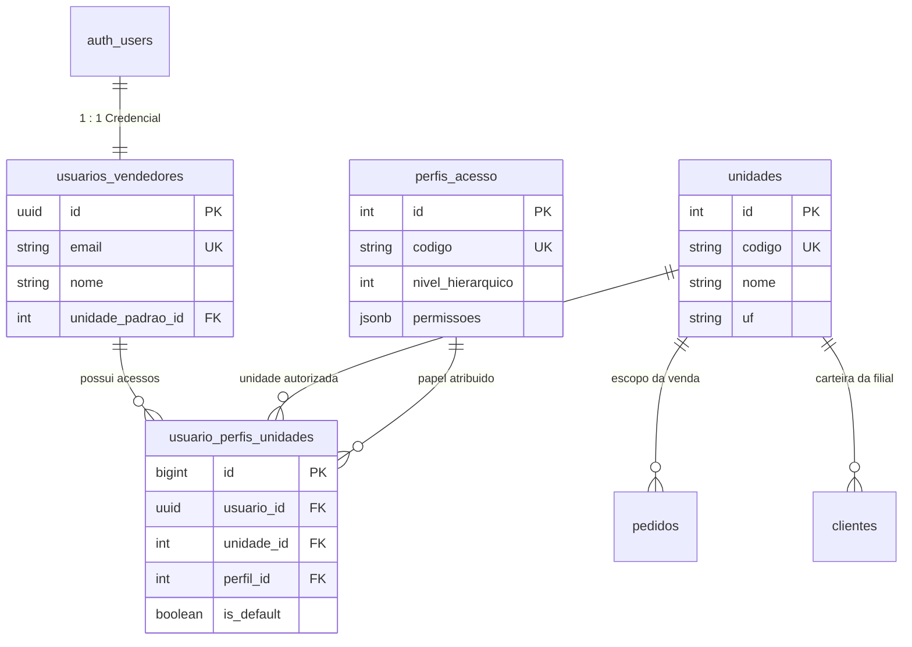
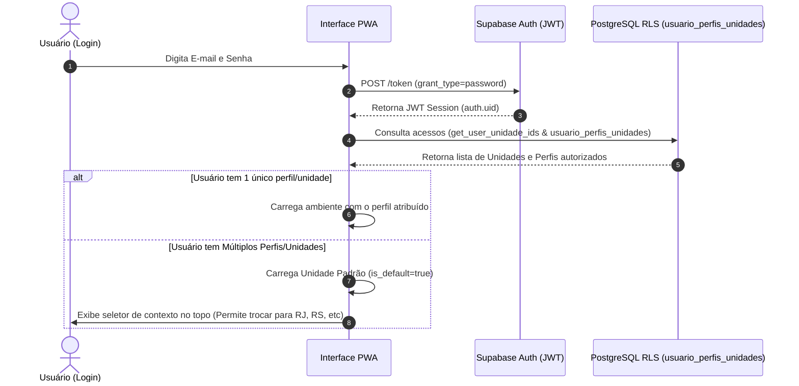

# 🛡️ Arquitetura IAM (Identity & Access Management) - Ampla Vendas Pro

## Visão Geral do IAM Multi-Perfil & Multi-Unidade

* **Single Identity (Único Login):** O usuário possui uma única credencial de autenticação (`auth.users.id`).
* **Multi-Unidade & Multi-Perfil:** A mesma identidade pode possuir permissões atribuídas a múltiplas unidades organizacionais (ex: `SP-FARIALIMA`, `RJ-CENTRO`, `RS-PORTOALEGRE`) com perfis distintos (`ADMIN_GLOBAL`, `GERENTE_UNIDADE`, `VENDEDOR_CAMPO`).
* **Seleção Contextual (Padrão + Optativo):** No login, o usuário assume automaticamente sua **Unidade/Perfil Padrão** (`is_default = true`). Caso possua múltiplos acessos, a interface permite alterar o contexto de trabalho ativamente sem necessidade de novo login.

---

## Diagrama de Entidades IAM (RBAC + Tenancy)

---

## Fluxo de Autenticação e Seleção de Contexto no Login

