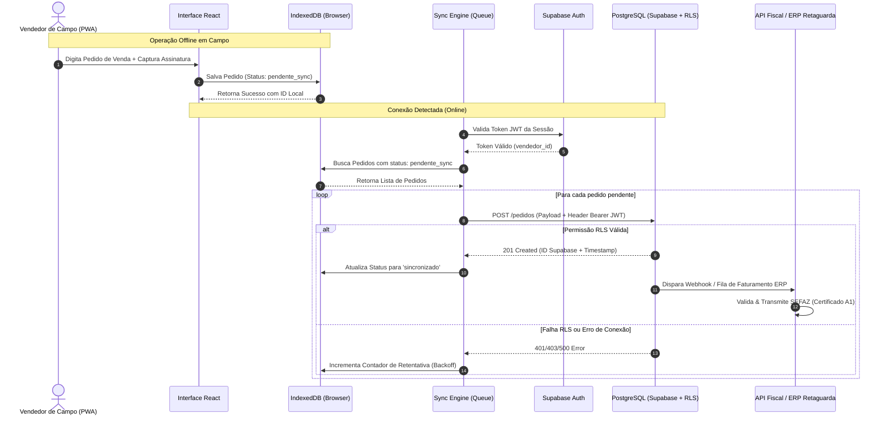

# 🔄 Diagrama de Sequência: Sincronização Offline-to-Online

```mermaid
sequenceDiagram
    autonumber
    actor Vendedor as Vendedor de Campo (PWA)
    participant UI as Interface React
    participant IDB as IndexedDB (Browser)
    participant Sync as Sync Engine (Queue)
    participant Auth as Supabase Auth
    participant DB as PostgreSQL (Supabase + RLS)
    participant ERP as API Fiscal / ERP Retaguarda

    Note over Vendedor, IDB: Operação Offline em Campo
    Vendedor->>UI: Digita Pedido de Venda + Captura Assinatura
    UI->>IDB: Salva Pedido (Status: pendente_sync)
    IDB-->>UI: Retorna Sucesso com ID Local

    Note over UI, DB: Conexão Detectada (Online)
    Sync->>Auth: Valida Token JWT da Sessão
    Auth-->>Sync: Token Válido (vendedor_id)
    Sync->>IDB: Busca Pedidos com status: pendente_sync
    IDB-->>Sync: Retorna Lista de Pedidos
    
    loop Para cada pedido pendente
        Sync->>DB: POST /pedidos (Payload + Header Bearer JWT)
        alt Permissão RLS Válida
            DB-->>Sync: 201 Created (ID Supabase + Timestamp)
            Sync->>IDB: Atualiza Status para 'sincronizado'
            DB->>ERP: Dispara Webhook / Fila de Faturamento ERP
            ERP->>ERP: Valida & Transmite SEFAZ (Certificado A1)
        else Falha RLS ou Erro de Conexão
            DB-->>Sync: 401/403/500 Error
            Sync->>IDB: Incrementa Contador de Retentativa (Backoff)
        end
    end
```
